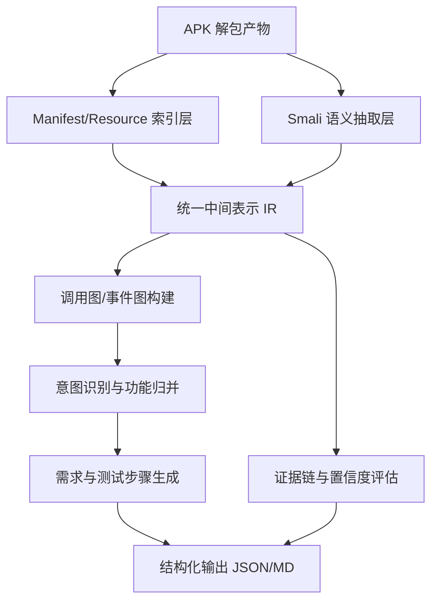

# Smali 解析能力增强技术方案（Update 预研文档）

## 1. 文档目的
本文档用于定义一套可插拔的 Smali 深度解析增强方案，目标是在 **不修改现有主流程逻辑** 的前提下，将 APK 反编译结果的理解能力从“Activity 摘要级”提升到“接近源码解析级”的需求推断能力。

适用范围：
- 输入：APK 反编译目录（`smali*`、`AndroidManifest.xml`、`res/layout`、`res/values` 等）
- 输出：更高质量的用户意图、功能需求、测试步骤与证据链
- 落地位置：`Req/tools/update/`（预留模块，后续热插拔）

---

## 2. 现有能力与主要瓶颈

### 2.1 现有链路（已实现）
当前流程核心在：
- `Req/tools/parse_flow.py`
- `Req/tools/merge_activity.py`
- `Req/tools/understand_activity.py`
- `Req/llm/activity_analysis.py`

简化后流程：
1. 使用 `apktool` 解包 APK。
2. 从 Manifest 提取 Activity 列表。
3. 按 Activity 名称前缀收集 smali 文件并合并方法文本。
4. 将合并文本送入 LLM 生成页面功能摘要（短文本）。

### 2.2 已知瓶颈
1. 解析粒度偏粗：
- 主要以 Activity 为单位做“平铺摘要”，缺少方法级控制流/调用链建模。

2. 语义恢复不完整：
- 对资源 ID（`R.id.xxx`）、字符串常量、布局控件的映射较弱。
- UI 触发链（点击 -> 校验 -> 服务调用 -> 页面跳转）提取不足。

3. 证据链不够结构化：
- 当前输出偏自然语言，缺少“功能结论 <-> smali证据 <-> 资源证据”三方对齐。

4. 需求生成可测性不足：
- 难以稳定产出“前置条件-步骤-断言”结构化测试步骤。

---

## 3. 目标定义（近似源码解析）

### 3.1 目标能力
在 Smali 输入下，尽量恢复接近源码级的以下能力：
1. 页面与功能入口识别（Activity/Fragment/Dialog）。
2. 关键 UI 元素识别（输入框、按钮、菜单、列表、开关）。
3. 事件处理链路识别（onClick/onItemSelected/TextWatcher 等）。
4. 业务调用链识别（Service/Repository/DB/Network）。
5. 条件与异常分支识别（空值校验、权限、错误提示）。
6. 用户意图与需求项自动生成（FR + 测试步骤 + 预期）。
7. 证据可追溯（可定位到 smali 文件、方法、行段、资源项）。

### 3.2 非目标
1. 不追求完整反编译还原 Java/Kotlin AST。
2. 不覆盖动态加密壳/强混淆全部情况。
3. 不替代真实源码静态分析器，只实现“APK条件下的近似解析”。

---

## 4. 总体架构（可插拔）



分层说明：
1. 索引层：建立 Manifest、布局、字符串、ID 的快速索引。
2. 语义层：从 Smali 指令恢复方法语义片段。
3. IR 层：统一表达 UI、事件、调用、数据流节点。
4. 图层：构建调用图（Call Graph）和事件流图（Event Graph）。
5. 推断层：识别用户意图并归并为功能模块。
6. 输出层：产出需求、步骤、证据、置信度。

---

## 5. 关键技术设计

## 5.1 资源语义恢复（Resource Recovery）
输入：
- `res/layout/*.xml`
- `res/values/strings*.xml`
- `public.xml` / `R` 映射相关产物（若可得）

输出：
- `resource_index.json`：
  - `view_id -> 控件类型/文本/布局位置`
  - `string_id -> 文案`
  - `layout -> 控件树`

实现要点：
1. 从 XML 中抽取 `android:id`、`hint`、`text`、`inputType`、`onClick`。
2. 识别输入型控件（EditText/AutoCompleteTextView）与动作型控件（Button/ImageButton）。
3. 将中文文案与功能词典映射，用于后续意图识别（如“登录/注册/搜索/保存”）。

## 5.2 Smali 中间表示 IR（Smali IR）
定义统一实体：
1. `ClassNode`：类名、父类、接口。
2. `MethodNode`：方法签名、参数、返回值、基础块。
3. `InstructionNode`：关键指令类型（invoke、if、goto、const、iput、iget 等）。
4. `UiActionNode`：`findViewById`、`setOnClickListener`、`setText`、`Toast`、`startActivity`。
5. `DataNode`：输入值、常量、偏好存储、DB 访问、网络请求。

关键策略：
1. 只抽“语义关键指令”，不还原全量字节码细节。
2. 以模板规则映射常见 Smali 指令组合到高层语义动作。
3. 记录证据位置信息：`file + method + line_span`。

## 5.3 控制流与调用链恢复
目标：
- 还原“用户动作 -> 校验 -> 调用 -> 反馈”的最短可解释链。

方法：
1. 方法内 CFG：
- 按标签与跳转指令切分基本块。
- 提取 if/else/return 分支条件（尤其是空值校验）。

2. 跨方法调用图：
- 建立 `invoke-*` 到目标方法的映射。
- 对匿名内部类、lambda 合成类做归并映射（名称规约）。

3. 事件流图：
- 重点识别 `onCreate`、`onClick`、`TextWatcher`、`onActivityResult`。
- 把 UI 控件与事件处理函数绑定。

## 5.4 用户意图识别（Intent Mining）
输入：
- 事件链路
- UI 文案与控件属性
- 业务方法命名特征

输出：
- `intent_units[]`，每个单元包含：
  - 功能名
  - 触发入口
  - 参数输入
  - 系统响应
  - 成功/失败条件
  - 证据集合

策略：
1. 规则优先：先用高精度规则抽“登录/注册/搜索/设置/支付”等。
2. LLM补全：对规则难覆盖场景，让 LLM 在证据约束下补全描述。
3. 置信度融合：规则分 + 证据覆盖率 + LLM一致性。

## 5.5 需求与步骤生成（Requirements + Steps）
生成对象：
1. 软件需求（FR）
2. 测试需求（TC）
3. 操作步骤（Step 序列）

生成约束：
1. 每条需求必须包含证据来源 ID。
2. 每个步骤必须映射到至少一个事件节点或资源节点。
3. 对不可验证描述标记低置信并进入人工校对队列。

---

## 6. 建议输出数据结构

## 6.1 意图单元（intent_units.json）
```json
{
  "intent_id": "INT-001",
  "name": "用户登录",
  "entry": "LoginActivity",
  "steps": [
    "进入登录页",
    "输入邮箱",
    "输入密码",
    "点击登录",
    "验证跳转首页"
  ],
  "success_signal": ["startActivity(MainActivity)"],
  "failure_signal": ["Toast: 邮箱或密码错误"],
  "evidence": [
    {
      "type": "smali",
      "file": "smali/com/example/.../LoginActivity.smali",
      "method": "onCreate",
      "line_span": "120-210"
    },
    {
      "type": "layout",
      "file": "res/layout/activity_login.xml",
      "id": "@+id/btn_login"
    }
  ],
  "confidence": 0.86
}
```

## 6.2 桥接输出（legacy_parse_bundle.json）
```json
{
  "manifest": {},
  "resource_stats": {},
  "smali_stats": {},
  "intent_filters": {},
  "intent_units": [],
  "legacy_activity_analysis_json": ".../activity_analysis_enhanced.json",
  "legacy_activity_analysis_txt": ".../activity_analysis_enhanced.txt",
  "prompt_context_txt": ".../prompt_context_enhanced.txt"
}
```

---

## 7. 质量评估指标

建议建立以下指标用于验证“接近源码解析”效果：
1. 入口识别召回率：
- 实际页面入口中被识别出的比例。

2. 事件链完整率：
- 有无覆盖“触发-处理-反馈”三个阶段。

3. 步骤可执行率：
- 生成步骤可直接用于测试执行的比例。

4. 需求可追溯率：
- 具备证据链绑定的需求占比。

5. 人工修订率：
- 人工需要大幅改写的需求比例（目标逐步下降）。

---

## 8. 与现有系统的无侵入集成策略

原则：
- 不修改原链路逻辑。
- 通过“旁路增强 + 可选开关”方式接入。

建议方式：
1. 在 `Req/tools/update/` 新建增强管线脚本，输入沿用当前 `parse_flow` 产物目录。
2. 输出独立增强文件，不覆盖原输出。
3. 后续在服务层增加配置开关：
- `enable_smali_deep_intent_enhancement=true/false`
4. 默认关闭，按任务选择开启。

---

## 9. 分阶段实施计划

### 阶段A：结构化基础（1-2 周）
1. 资源索引与 Smali IR 抽取。
2. 事件链路与调用图原型。
3. 输出 `intent_units.json`。

### 阶段B：需求增强（1-2 周）
1. 意图归并 + FR/TC 生成模板。
2. 步骤生成与证据绑定。
3. 置信度评分与低置信告警。

### 阶段C：对齐优化（持续）
1. 规则词典扩展（多应用域）。
2. 与人工反馈闭环（修正样本反哺规则）。
3. 指标看板与自动回归评估。

---

## 10. 风险与应对

1. 混淆代码导致语义缺失：
- 以资源与行为证据补强，降低对命名语义依赖。

2. 多 dex 与大包体性能压力：
- 先按入口切片，再做增量解析与缓存。

3. LLM 幻觉风险：
- 强制证据引用；无证据结论标记低置信。

4. 跨应用适配差异：
- 将规则库模块化，按应用类型加载规则模板。

---

## 11. 预期效果

落地后预期可实现：
1. 从“Activity 简述”升级到“意图单元 + 证据链 + 可执行步骤”。
2. 需求与测试场景的可测性、可追溯性显著提升。
3. 在无源码条件下，达到接近源码解析的需求还原能力。

---

## 12. 后续实现建议（仅建议，不改现有逻辑）

可在 `Req/tools/update/` 后续新增：
1. `resource_indexer.py`：资源索引构建。
2. `smali_ir_builder.py`：Smali IR 抽取。
3. `intent_graph_builder.py`：事件流与调用图融合。
4. `legacy_bridge.py`：意图到原系统可复用解析输入的桥接导出。
5. `run_smali_enhancement.py`：增强管线入口。

以上模块均以旁路方式读取现有产物并输出增强结果，不替换原文件。
